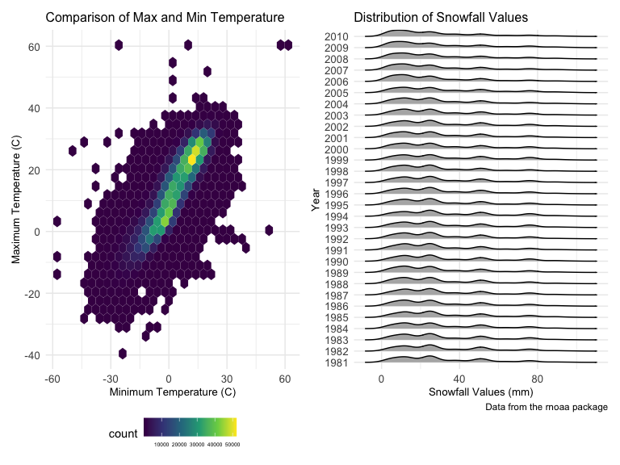

p8105_hw3_yx2638
================
Yifei Xu
2022-10-15

# Problem 1

#### Read in the data

``` r
data("instacart")

instacart = 
        instacart %>% 
        as_tibble(instacart)
```

#### Answer questions about the data

The dataset `instacart` contains 1384617 rows and each row respresents a
single product from an instacart order. 15 variables include identifiers
for user, order, and product; the order in which each product was added
to the cart. There are several order-level variables, describing the day
and time of the order, and number of days since prior order. Then there
are several item-specific variables, describing the product name
(e.g. Yogurt, Avocado), department (e.g. dairy and eggs, produce), and
aisle (e.g. yogurt, fresh fruits), and whether the item has been ordered
by this user in the past.

In total, there are 39123 products found in 131209 orders from 131209
distinct users.

#### Make a plot that shows the number of items ordered in each aisle

``` r
instacart %>% 
        count(aisle) %>% 
        arrange(desc(n))
```

    ## # A tibble: 134 × 2
    ##    aisle                              n
    ##    <chr>                          <int>
    ##  1 fresh vegetables              150609
    ##  2 fresh fruits                  150473
    ##  3 packaged vegetables fruits     78493
    ##  4 yogurt                         55240
    ##  5 packaged cheese                41699
    ##  6 water seltzer sparkling water  36617
    ##  7 milk                           32644
    ##  8 chips pretzels                 31269
    ##  9 soy lactosefree                26240
    ## 10 bread                          23635
    ## # … with 124 more rows

``` r
instacart %>% 
        count(aisle) %>% 
        filter(n > 10000) %>% 
        mutate(aisle = fct_reorder(aisle, n)) %>% 
        ggplot(aes(x = aisle, y = n)) + 
        geom_point() + 
        labs(title = "Number of items ordered in each aisle") +
        theme(axis.text.x = element_text(angle = 60, hjust = 1))
```


In total, there are 134 aisles, with fresh vegetables and fresh fruits
holding the most items ordered by far. The plot shows the number of
items ordered in each aisle and aisles are ordered by ascending number
of items.

#### Make a table

showing the three most popular items in each of the aisles and order
times

``` r
instacart %>% 
        filter(aisle %in% c("baking ingredients", "dog food care", "packaged vegetables fruits")) %>%
        group_by(aisle) %>% 
        count(product_name) %>% 
        mutate(rank = min_rank(desc(n))) %>% 
        filter(rank < 4) %>% 
        arrange(desc(n)) %>%
        knitr::kable()
```

| aisle                      | product_name                                  |    n | rank |
|:---------------------------|:----------------------------------------------|-----:|-----:|
| packaged vegetables fruits | Organic Baby Spinach                          | 9784 |    1 |
| packaged vegetables fruits | Organic Raspberries                           | 5546 |    2 |
| packaged vegetables fruits | Organic Blueberries                           | 4966 |    3 |
| baking ingredients         | Light Brown Sugar                             |  499 |    1 |
| baking ingredients         | Pure Baking Soda                              |  387 |    2 |
| baking ingredients         | Cane Sugar                                    |  336 |    3 |
| dog food care              | Snack Sticks Chicken & Rice Recipe Dog Treats |   30 |    1 |
| dog food care              | Organix Chicken & Brown Rice Recipe           |   28 |    2 |
| dog food care              | Small Dog Biscuits                            |   26 |    3 |

#### Make a table

showing the mean hour of the day at which Pink Lady Apples and Coffee
Ice Cream are ordered

``` r
instacart %>%
        filter(product_name %in% c("Pink Lady Apples", "Coffee Ice Cream")) %>%
        group_by(product_name, order_dow) %>%
        summarize(mean_hour = mean(order_hour_of_day)) %>%
        spread(key = order_dow, value = mean_hour) %>%
        knitr::kable(digits = 2)
```

    ## `summarise()` has grouped output by 'product_name'. You can override using the
    ## `.groups` argument.

| product_name     |     0 |     1 |     2 |     3 |     4 |     5 |     6 |
|:-----------------|------:|------:|------:|------:|------:|------:|------:|
| Coffee Ice Cream | 13.77 | 14.32 | 15.38 | 15.32 | 15.22 | 12.26 | 13.83 |
| Pink Lady Apples | 13.44 | 11.36 | 11.70 | 14.25 | 11.55 | 12.78 | 11.94 |

Pink Lady Apples are generally purchased slightly earlier in the day
than Coffee Ice Cream, with the exception of day 5.

# Problem 2

#### Read in the data

``` r
accel = read_csv("data/accel_data.csv") 
```

#### Tidy and wrangle the data

``` r
accel_tidy = accel %>%
        janitor::clean_names() %>%
        pivot_longer(activity_1:activity_1440, 
                     names_to = "minute", 
                     values_to = "activity_counts", 
                     names_prefix =  "activity_") %>%
        mutate(day = day %>% 
                       fct_relevel("Monday", "Tuesday", "Wednesday","Thursday","Friday", "Saturday", "Sunday")) %>% 
        mutate(weekday_vs_weekend = ifelse(day %in% c("Saturday", "Sunday"), "weekend", "weekday")) %>%
        mutate(minute = as.integer(minute)) 
```

The resulting dataset contains 50400 observations. 6 key variables
include week, day_id, day, minute, activity_counts, weekday_vs_weekend.
Each observation represent a male’s activity count per minute of each
day during five weeks.

#### Create a table to show the total activity counts

``` r
# aggregate across minutes to create a total activity variable for each day, and create a table showing these totals
accel_tidy %>%
        group_by(week, day) %>%
        rename(Week = week) %>%
        summarize(total_activity_counts = sum(activity_counts)) %>%
        spread(key = day, total_activity_counts) %>%
        knitr::kable(digits = 0)
```

| Week | Monday | Tuesday | Wednesday | Thursday | Friday | Saturday | Sunday |
|-----:|-------:|--------:|----------:|---------:|-------:|---------:|-------:|
|    1 |  78828 |  307094 |    340115 |   355924 | 480543 |   376254 | 631105 |
|    2 | 295431 |  423245 |    440962 |   474048 | 568839 |   607175 | 422018 |
|    3 | 685910 |  381507 |    468869 |   371230 | 467420 |   382928 | 467052 |
|    4 | 409450 |  319568 |    434460 |   340291 | 154049 |     1440 | 260617 |
|    5 | 389080 |  367824 |    445366 |   549658 | 620860 |     1440 | 138421 |

We cannot observe apparent trend from the table. However, it’s obvious
that the total activity accounts on Saturdays in week 4 and week 5 is
far lower than any other days.

#### Make a single-panel plot that shows the 24-hour activity time courses for each day

``` r
accel_tidy %>%
        group_by(day, minute) %>%
        rename(Day = day) %>%
        ggplot(aes(x = minute, y = activity_counts)) +
        geom_point(aes(color = Day), alpha = 0.6) +
        scale_color_brewer(palette = "Set1") +
        geom_smooth() + 
        scale_x_continuous(
                breaks = c(0, 180, 360, 540, 720, 900, 1080, 1260, 1440),
                labels = c("12am", "3am", "6am", "9am", "12pm", "3pm", "6pm", "9pm", "12am")) + 
        labs(x = "Time", 
             y = "Activity Counts", 
             title = "24-hour Activity Time Courses for Each Day")
```


Within a day, we can observe that the activity count of this male is
very low between 12am and 3am, and then begins to increase. Around
9-12am, the activity count reaches the first peak, after then it remains
with little fluctuation. The second peak occurs around 9pm, after which
the activity account begins to decline.

Within weekday, his activity count is relatively high around 7am on some
Thursdays and around 9am on some Fridays. As for the weekend, the
activity count is high in the afternoon, especially around 4-5pm on
Saturday and around 12pm on Sunday. Between 8-10pm, the count is usually
high across many days, especially on Friday.

From this plot, we can roughly identify his daily schedule (such as the
time of wake-up and sleep).

# Problem 3

#### Read in the data

``` r
data("ny_noaa")

ny_noaa = 
  ny_noaa %>% 
  as_tibble(ny_noaa)
```

#### Tidy and wrangle the data

``` r
ny_noaa_tidy = ny_noaa %>%
        janitor::clean_names() %>%
        separate(date, into = c("year", "month", "day")) %>%
        arrange(year, month) %>%
        mutate(year = as.numeric(year),
               month = month.name[as.numeric(month)],
               day = as.numeric(day)) %>%
        mutate(prcp = prcp/10,
               tmax = as.numeric(tmax)/10,
               tmin = as.numeric(tmin)/10) 
```

`NY NOAA` collected weather data all New York state weather stations
from January 1, 1981 through December 31, 2010. The tidy dataset has
2595176 observations, with 9 key variables, including id, year, month,
day, prcp, snow, snwd, tmax, tmin.

The `id` is a character variable. We separate the date into `year`,
`month` and `day`, which are numeric, character, numeric variable,
respectively. `prcp`, `snow`, `snwd`, `tmax`, `tmin` are numeric
variables. The unit for precipitation, snowfall and snow depth is
unified as “mm”, while the unit for maximum temperature `tmax` and
minimum temperature `tmin` which maximum temperature and minimum
temperature is both “degrees C”.

Each weather station may only collect a subset of these variables, which
can lead to problems with missing data in the dataset. Missing data
occurs in precipitation, snowfall, snow depth, maximum temperature and
minimum temperature, accounting for 5.62%, 14.69%, 22.80%, 43.71% and
43.71%, respectively. We cannot ignore this issue due to the large
proportion. The sample is not very representative and the results of our
analysis might be less convincing.

#### Identify the most commonly observed values for snowfall

``` r
ny_noaa_tidy %>%
        group_by(snow) %>%
        summarize(num = n()) %>%
        arrange(desc(num))
```

    ## # A tibble: 282 × 2
    ##     snow     num
    ##    <int>   <int>
    ##  1     0 2008508
    ##  2    NA  381221
    ##  3    25   31022
    ##  4    13   23095
    ##  5    51   18274
    ##  6    76   10173
    ##  7     8    9962
    ##  8     5    9748
    ##  9    38    9197
    ## 10     3    8790
    ## # … with 272 more rows

For snowfall, the most commonly observed value is 0. This is because
snowfall is an infrequent occurrence in New York state. It does not snow
for most of the time throughout the whole year due to the geographical
location.

#### Make a two-panel plot showing the average max temperature

``` r
# Show the average max temperature in January and in July in each station across years
Jan_Jul = ny_noaa_tidy %>%
        filter(month %in% c("January", "July")) %>%
        drop_na(tmax) %>%
        group_by(id, year, month) %>%
        summarize(avg_tmax = mean(tmax))


Jan_Jul %>%
        ggplot(aes(x = year, y = avg_tmax)) + 
        geom_point(alpha = 0.6) + 
        geom_smooth() +
        facet_grid(. ~ month) +
        labs(x = "Year",
             y = "Average Max Temperature (C)",
             title = "Average Max Temperature in January and July Across Years",
             caption = "Data from the rnoaa package.
             Each point represents the average max temperature of a station at the given time") +
        theme(plot.title = element_text(size = 12)) +
        theme(axis.title = element_text(size = 10)) +
        theme(axis.text = element_text(size = 10))
```


From the two-panel plot, we can intuitively see that the average max
temperature in January is much slower than that in July. As is known to
all, New York is New York is in the northern hemisphere and January is
still winter and is much colder than July, which is in summer. The
average max temperature in January fluctuates greatly across years while
in July, the average max temperature is relatively stable across years.
From my point of view, that extreme weather often occurs in January
might account for the pattern.

In addition, outliers exist in both January and July, which are some
abnormally extreme low temperature.

#### Make another two-panel plot

``` r
# (i) show tmax vs tmin for the full dataset
tmax_tmin = ny_noaa_tidy %>%
        drop_na(tmin, tmax) %>%
        ggplot(aes(x = tmin, y = tmax)) +
        geom_hex() + 
        labs(x = "Minimum Temperature (C)", 
             y = "Maximum Temperature (C)",
             title = "Comparison of Max and Min Temperature") +
        theme(plot.title = element_text(size = 12)) +
        theme(axis.title = element_text(size = 10)) +
        theme(axis.text = element_text(size = 10)) +
        theme(legend.text = element_text(size = 5))


# (ii) show the distribution of snowfall values greater than 0 and less than 100 separately by year
snow_dist = ny_noaa_tidy %>%
        filter(snow < 100 & snow > 0) %>%
        ggplot(aes(x = snow, y = as.factor(year))) +
        geom_density_ridges(scale = 0.6) + 
        labs(x = "Snowfall Values (mm)",
             y = "Year",
             title = "Distribution of Snowfall Values",
             caption = "Data from the rnoaa package") +
        theme(plot.title = element_text(size = 12)) +
        theme(axis.title = element_text(size = 10)) +
        theme(axis.text = element_text(size = 10))

# patch these two plots
tmax_tmin + snow_dist 
```



From this two-panel plot, we can observe that the maximal and minimal
temperature may have a positive correlation and the temperature is
around 0 to 25 degrees C for most of the time. The distribution of
snowfall values (0-100mm) is quite similar across the years. The
snowfall values concentrate between 0 and 30mm and can reach 50-80mm
under some extreme weather conditions, which is rare.
