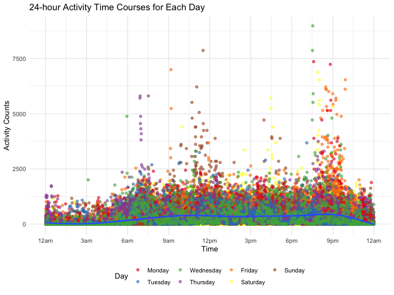
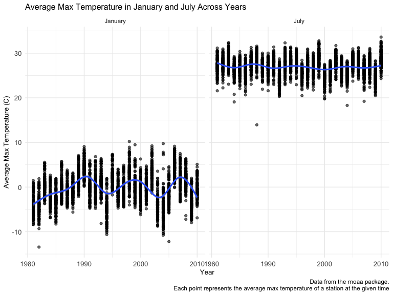

p8105_hw3_yx2638
================
Yifei Xu
2022-10-15

# Problem 2

#### Read in the data

``` r
accel = read_csv("data/accel_data.csv") 
```

#### Tidy and wrangle the data

``` r
accel_tidy = accel %>%
        janitor::clean_names() %>%
        pivot_longer(activity_1:activity_1440, names_to = "minute", values_to = "activity_counts", names_prefix =  "activity_") %>%
        mutate(day = day %>% 
                       fct_relevel("Monday", "Tuesday", "Wednesday","Thursday","Friday", "Saturday", "Sunday")) %>% 
        mutate(weekday_vs_weekend = ifelse(day %in% c("Saturday", "Sunday"), "weekend", "weekday")) %>%
        mutate(minute = as.integer(minute)) 
```

The resulting dataset contains 50400 observations. 6 key variables
include week, day_id, day, minute, activity_counts, weekday_vs_weekend.
Each observation represent a male’s activity count per minute of each
day during five weeks.

#### Create a table to show the total activity counts

``` r
# aggregate across minutes to create a total activity variable for each day, and create a table showing these totals
accel_tidy %>%
        group_by(week, day) %>%
        summarize(total_activity_counts = sum(activity_counts)) %>%
        knitr::kable(align = "c", format = "pipe",
                     col.names = c("Week","Day","Total Activity Count"))
```

| Week |    Day    | Total Activity Count |
|:----:|:---------:|:--------------------:|
|  1   |  Monday   |       78828.07       |
|  1   |  Tuesday  |      307094.24       |
|  1   | Wednesday |      340115.01       |
|  1   | Thursday  |      355923.64       |
|  1   |  Friday   |      480542.62       |
|  1   | Saturday  |      376254.00       |
|  1   |  Sunday   |      631105.00       |
|  2   |  Monday   |      295431.00       |
|  2   |  Tuesday  |      423245.00       |
|  2   | Wednesday |      440962.00       |
|  2   | Thursday  |      474048.00       |
|  2   |  Friday   |      568839.00       |
|  2   | Saturday  |      607175.00       |
|  2   |  Sunday   |      422018.00       |
|  3   |  Monday   |      685910.00       |
|  3   |  Tuesday  |      381507.00       |
|  3   | Wednesday |      468869.00       |
|  3   | Thursday  |      371230.00       |
|  3   |  Friday   |      467420.00       |
|  3   | Saturday  |      382928.00       |
|  3   |  Sunday   |      467052.00       |
|  4   |  Monday   |      409450.00       |
|  4   |  Tuesday  |      319568.00       |
|  4   | Wednesday |      434460.00       |
|  4   | Thursday  |      340291.00       |
|  4   |  Friday   |      154049.00       |
|  4   | Saturday  |       1440.00        |
|  4   |  Sunday   |      260617.00       |
|  5   |  Monday   |      389080.00       |
|  5   |  Tuesday  |      367824.00       |
|  5   | Wednesday |      445366.00       |
|  5   | Thursday  |      549658.00       |
|  5   |  Friday   |      620860.00       |
|  5   | Saturday  |       1440.00        |
|  5   |  Sunday   |      138421.00       |

We cannot observe apparent trend from the table. However, it’s obvious
that the total activity accounts on Saturdays in week 4 and week 5 is
far lower than any other days.

#### Make a single-panel plot that shows the 24-hour activity time courses for each day

``` r
accel_tidy %>%
        group_by(day, minute) %>%
        rename(Day = day) %>%
        ggplot(aes(x = minute, y = activity_counts)) +
        geom_point(aes(color = Day), alpha = 0.6) +
        scale_color_brewer(palette = "Set1") +
        geom_smooth() + 
        scale_x_continuous(
                breaks = c(0, 180, 360, 540, 720, 900, 1080, 1260, 1440),
                labels = c("12am", "3am", "6am", "9am", "12pm", "3pm", "6pm", "9pm", "12am")) + 
        labs(x = "Time", 
             y = "Activity Counts", 
             title = "24-hour Activity Time Courses for Each Day")
```



Within a day, we can observe that the activity count of this male is
very low between 12am and 3am, and then begins to increase. Around 9am,
the activity count reaches the first peak, after then it remains with
little fluctuation. The second peak occurs around 9pm, after which the
activity account begins to decline.

Within weekday, his activity count is relatively high around 7am on some
Thursdays and around 9am on some Fridays. As for the weekend, the
activity count is high in the afternoon, especially around 4-5pm on
Saturday and around 12pm on Sunday. Between 8-10pm, the count is usually
high across many days, especially on Friday.

From this plot, we can roughly identify his daily schedule (such as the
time of wake-up and sleep).

# Problem 3

#### Read in the data

``` r
data("ny_noaa")

ny_noaa = 
  ny_noaa %>% 
  as_tibble(ny_noaa)
```

#### Tidy and wrangle the data

``` r
ny_noaa_tidy = ny_noaa %>%
        janitor::clean_names() %>%
        separate(date, into = c("year", "month", "day")) %>%
        arrange(year, month) %>%
        mutate(year = as.numeric(year),
               month = month.name[as.numeric(month)],
               day = as.numeric(day)) %>%
        mutate(prcp = prcp/10,
               tmax = as.numeric(tmax)/10,
               tmin = as.numeric(tmin)/10) 
```

`NY NOAA` collected weather data all New York state weather stations
from January 1, 1981 through December 31, 2010. The tidy dataset has
2595176 observations, with 9 key variables, including id, year, month,
day, prcp, snow, snwd, tmax, tmin.

The `id` is a character variable. We separate the date into `year`,
`month` and `day`, which are numeric, character, numeric variable,
respectively. `prcp`, `snow`, `snwd`, `tmax`, `tmin` are numeric
variables. The unit for precipitation, snowfall and snow depth is
unified as “mm”, while the unit for maximum temperature `tmax` and
minimum temperature `tmin` which maximum temperature and minimum
temperature is both “degrees C”.

Each weather station may only collect a subset of these variables, which
can lead to problems with missing data in the dataset. Missing data
occurs in precipitation, snowfall, snow depth, maximum temperature and
minimum temperature, accounting for 5.62%, 14.69%, 22.80%, 43.71% and
43.71%, respectively. We cannot ignore this issue due to the large
proportion. The sample is not very representative and the results of our
analysis might be less convincing.

#### Identify the most commonly observed values for snowfall

``` r
ny_noaa_tidy %>%
        group_by(snow) %>%
        summarize(num = n()) %>%
        arrange(desc(num))
```

    ## # A tibble: 282 × 2
    ##     snow     num
    ##    <int>   <int>
    ##  1     0 2008508
    ##  2    NA  381221
    ##  3    25   31022
    ##  4    13   23095
    ##  5    51   18274
    ##  6    76   10173
    ##  7     8    9962
    ##  8     5    9748
    ##  9    38    9197
    ## 10     3    8790
    ## # … with 272 more rows

For snowfall, the most commonly observed value is 0. This is because
snowfall is an infrequent occurrence in New York state. It does not snow
for most of the time throughout the whole year due to the geographical
location.

#### Make a two-panel plot showing the average max temperature

``` r
# Show the average max temperature in January and in July in each station across years
Jan_Jul = ny_noaa_tidy %>%
        filter(month %in% c("January", "July")) %>%
        drop_na(tmax) %>%
        group_by(id, year, month) %>%
        summarize(avg_tmax = mean(tmax))


Jan_Jul %>%
        ggplot(aes(x = year, y = avg_tmax)) + 
        geom_point(alpha = 0.6) + 
        geom_smooth() +
        facet_grid(. ~ month) +
        labs(x = "Year",
             y = "Average Max Temperature (C)",
             title = "Average Max Temperature in January and July Across Years",
             caption = "Data from the rnoaa package.
             Each point represents the average max temperature of a station at the given time") +
        theme(plot.title = element_text(size = 12)) +
        theme(axis.title = element_text(size = 10)) +
        theme(axis.text = element_text(size = 10))
```



From the two-panel plot, we can intuitively see that the average max
temperature in January is much slower than that in July. As is known to
all, New York is New York is in the northern hemisphere and January is
still winter and is much colder than July, which is in summer. The
average max temperature in January fluctuates greatly across years while
in July, the average max temperature is relatively stable across years.
From my point of view, that extreme weather often occurs in January
might account for the pattern.

In addition, outliers exist in both January and July, which are some
abnormally extreme low temperature.

#### Make another two-panel plot

``` r
# (i) show tmax vs tmin for the full dataset
tmax_tmin = ny_noaa_tidy %>%
        drop_na(tmin, tmax) %>%
        ggplot(aes(x = tmin, y = tmax)) +
        geom_hex() + 
        labs(x = "Minimum Temperature (C)", 
             y = "Maximum Temperature (C)",
             title = "Comparison of Max and Min Temperature") +
        theme(plot.title = element_text(size = 12)) +
        theme(axis.title = element_text(size = 10)) +
        theme(axis.text = element_text(size = 10)) +
        theme(legend.text = element_text(size = 5))


# (ii) show the distribution of snowfall values greater than 0 and less than 100 separately by year
snow_dist = ny_noaa_tidy %>%
        filter(snow < 100 & snow > 0) %>%
        ggplot(aes(x = snow, y = as.factor(year))) +
        geom_density_ridges(scale = 0.6) + 
        labs(x = "Snowfall Values (mm)",
             y = "Year",
             title = "Distribution of Snowfall Values",
             caption = "Data from the rnoaa package") +
        theme(plot.title = element_text(size = 12)) +
        theme(axis.title = element_text(size = 10)) +
        theme(axis.text = element_text(size = 10))

# patch these two plots
tmax_tmin + snow_dist 
```


From this 2-panel plot, we can observe that the maximal and minimal
temperature may have a positive correlation and the temperature is
around 0 to 25 degrees C for most of the time. The distribution of
snowfall values (0-100mm) is quite similar across the years. The
snowfall values concentrate between 0 and 30mm and can reach 50-80mm
under some extreme weather conditions, which is rare.
